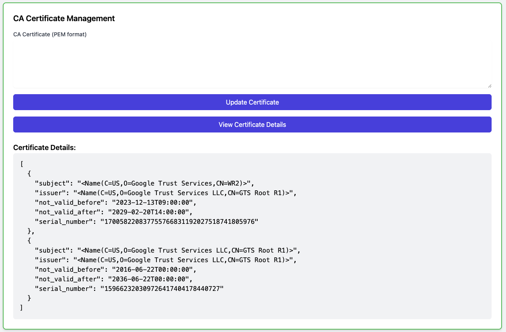
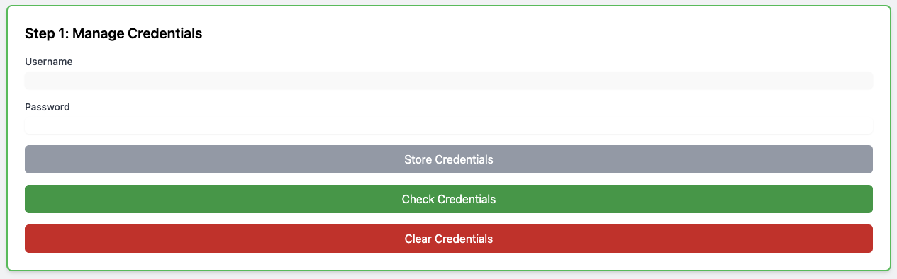
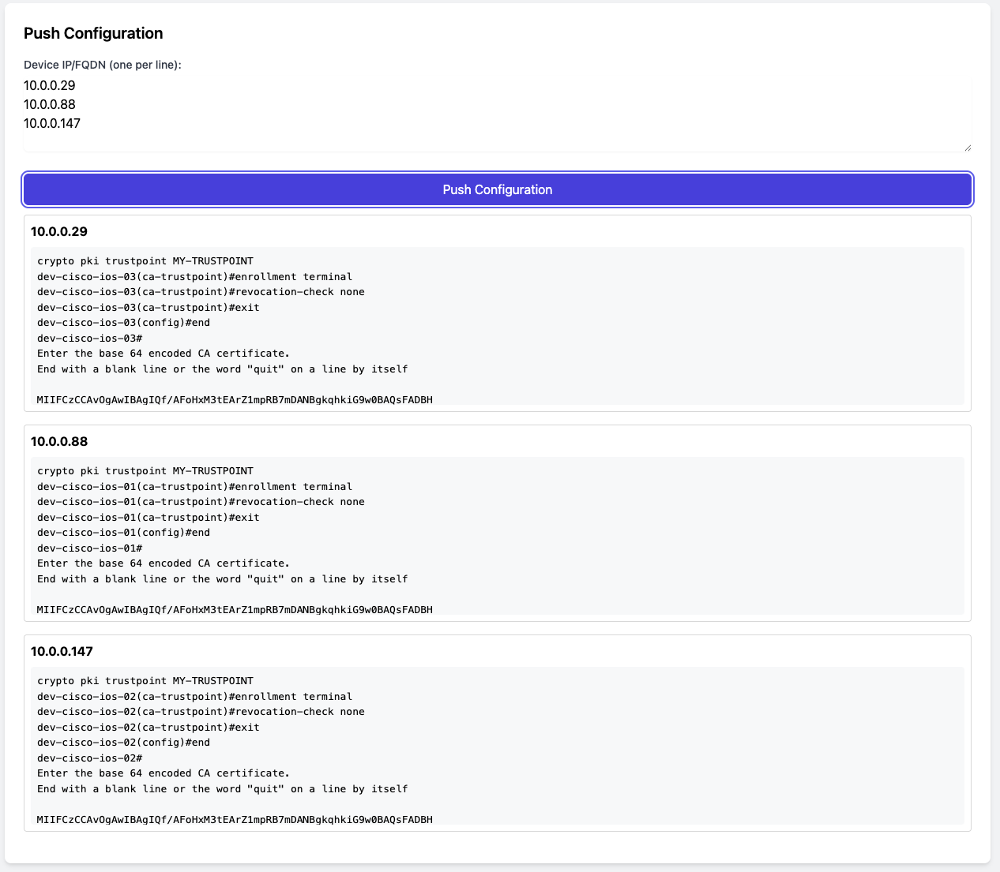

# Network Device Trustpoint Pusher

A web application for managing and pushing CA certificates to network devices.

## Features

- Store and manage CA certificates
- Secure credential management
- Push certificates to multiple network devices
- Real-time status monitoring
- Session logging for troubleshooting

## Screenshots

### CA Certificate Management

*Upload and manage CA certificates with ease*

### Credential Management

*Securely store and manage device credentials*

### Push Configuration

*Push certificates to multiple devices with real-time status updates*

## Installation

1. Clone the repository:
```bash
git clone https://github.com/jbhoorasingh/cisco-trustpoint-push.git
cd cisco-trustpoint-push
```

2. Install dependencies:
```bash
pip install -r requirements.txt
```

3. Run the application:
```bash
uvicorn main:app --reload
```

The application will be available at `http://localhost:8000`

## Usage

1. **Store CA Certificate**
   - Upload your CA certificate in PEM format
   - The certificate will be stored securely

2. **Store Credentials**
   - Enter device credentials
   - Credentials are encrypted and stored securely

3. **Push Configuration**
   - Enter one or more device IPs/FQDNs (one per line)
   - Click "Push Configuration"
   - Monitor real-time status for each device
   - Green check mark indicates success
   - Red X indicates failure

## Session Logs

Session logs are stored in the `data/session_logs` directory. Each device's session is logged separately for troubleshooting purposes.

## Security

- Credentials are encrypted using Fernet (symmetric encryption)
- CA certificates are stored securely
- No sensitive data is exposed in the logs

## Requirements

- Python 3.7+
- FastAPI
- Netmiko
- Cryptography
- Uvicorn

## License

This project is licensed under the MIT License - see the LICENSE file for details. 